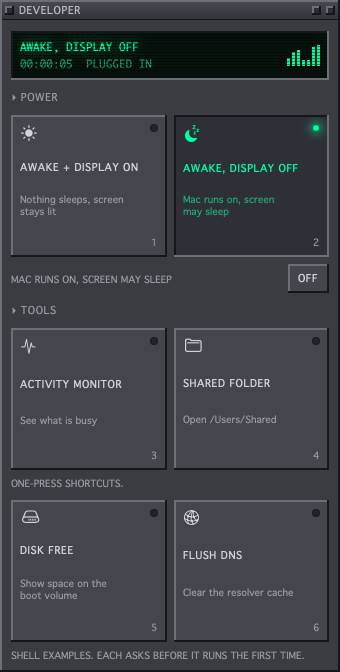
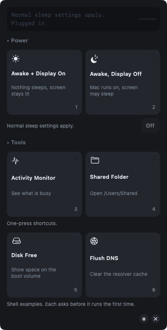
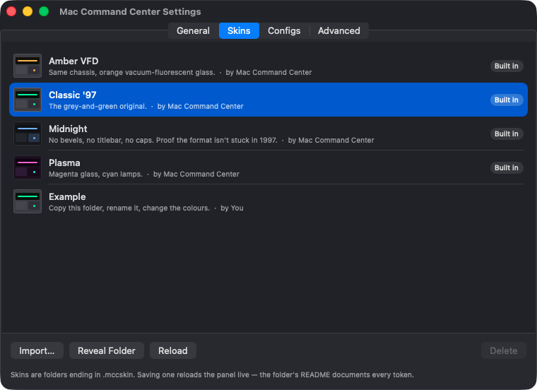
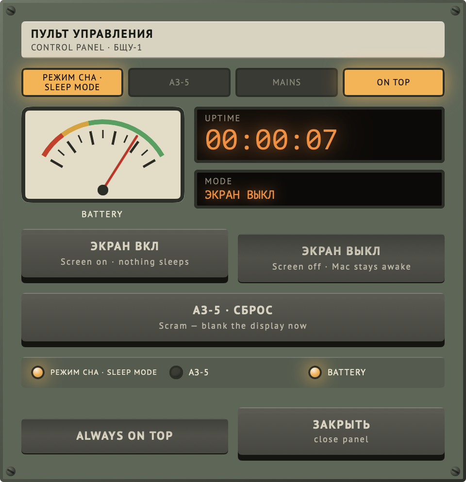
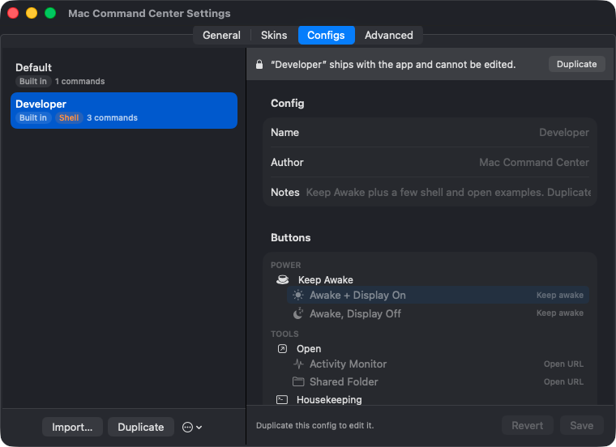

# Mac Command Center

[](https://github.com/leandrorsampaio/MacCommandCenter/actions/workflows/ci.yml)
[](LICENSE)
[](#)

A menu bar app for the Mac settings that live three clicks deep in System Settings —
starting with keeping the Mac awake while long work runs in a terminal.

The look and the buttons are both **files, not code**: a *skin* decides how the panel
looks, a *config* decides what is on it and what it does. Any skin works with any config.

<p align="center">
  
  &nbsp;&nbsp;
  
</p>

<p align="center">
  <em>The same config in two skins. Left: Classic '97, engaged — lit lamp, running clock,
  glowing readout. Right: Midnight, which sets <code>bevel: 0</code>,
  <code>titlebarHeight: 0</code> and <code>uppercase: false</code>.</em>
</p>

## Install

```bash
scripts/build-app.sh
open build/MacCommandCenter.app
```

Click the cup in the menu bar or press **⌘⇧K**. The window floats above other windows and
you can drag it anywhere. Right-click the menu bar icon for **Settings…**

## Keeping the Mac awake

| Mode | Effect |
|---|---|
| **Awake + Display On** | Nothing sleeps. Screen stays lit, screen saver and idle lock suppressed. |
| **Awake, Display Off** | The Mac keeps running — terminals, agents, builds — while the display is free to turn off. |

Both hold IOKit **idle-sleep assertions**, which macOS honours on battery *and* on mains.
That is the difference from `caffeinate -s`, which the system only respects while plugged
in. Assertions belong to the app process, so they vanish if it quits — the Mac cannot get
stuck awake.

*The one thing it cannot do:* on a laptop on battery, closing the lid still sleeps the
Mac. Clamshell sleep is enforced below the assertion layer, so no app can override it.

## Skins and configs

<p align="center">
  
</p>


Five skins ship with the app. **Reactor Control** is the one that shows what the format
can do: it declares a `layout`, so it is square, has an annunciator strip, a needle gauge,
an amber counter and latching keys — none of which the default panel has any concept of.

<p align="center">
  
</p>

```json
{ "name": "Red Alert", "colors": { "readoutInk": "#FF3B30", "ledOn": "#FF3B30" } }
```

Everything is optional — a manifest overrides only what it names. Saving a file reloads
the open window, so you can edit next to it. → **[docs/SKINS.md](docs/SKINS.md)**

A config is a `.mccconfig` folder that decides which buttons exist, what they say and what
they do: keep awake, open a URL, or run a shell command. Build one in **Settings › Configs**
or edit the JSON. → **[docs/CONFIGS.md](docs/CONFIGS.md)**

<p align="center">
  
</p>

Shell buttons are **inert until you approve the exact command**, and editing a command
asks again. A URL that can *start* something — `file:`, `shortcuts:`, any app's own scheme
— asks too; `http`, `https` and `mailto` do not. Configs are meant to be shared, and
without that "try my config" would mean "run my code."

## Two builds

|  | App Store | Direct download |
|---|---|---|
| Sandboxed | Yes | No |
| Shell actions | No | Yes |
| `mcc` CLI | No | Yes |

```bash
scripts/build-app.sh --channel mas   # sandboxed
scripts/package-direct.sh            # signed, notarized DMG
scripts/package-mas.sh               # signed .pkg for App Store Connect
```

Shell actions are compiled out of the App Store build, but a config using them still
loads — the button explains itself instead of vanishing, and the command survives a save.

## Automation and physical buttons

The app can listen on `127.0.0.1:8787`, loopback only, **off by default** (Settings ›
Advanced). Anything that can make a local request can drive it — a Stream Deck, Shortcuts,
or a hardware button box.

```bash
mcc awake display-off
curl -H "X-MCC-Client: 1" \
  "http://127.0.0.1:8787/v1/commands/keep-awake/toggle?option=display-off"
```

Reading is open; anything that **changes** state must send `X-MCC-Client` and no `Origin`
header. A web page can reach loopback with a simple cross-origin request, but it cannot
set a custom header without a preflight, and none is answered — so this keeps a browser
from driving your Mac while costing a script or a microcontroller one line.

For Shortcuts, Stream Deck, Raycast and hardware buttons — including a macro pad that
needs **no code at all** — see **[docs/AUTOMATION.md](docs/AUTOMATION.md)**.

## Development

```bash
swift test      # 56 tests, all offline
swift build -c release
```

No third-party dependencies. macOS 14+. `open Package.swift` gives a working Xcode
project. Architecture and house style are in **[CONTRIBUTING.md](CONTRIBUTING.md)**.

## Documentation

| | |
|---|---|
| [docs/SKINS.md](docs/SKINS.md) | Every colour, metric, font role and effect a skin can set |
| [docs/CONFIGS.md](docs/CONFIGS.md) | The config format and all three action types |
| [docs/AUTOMATION.md](docs/AUTOMATION.md) | Shortcuts, Stream Deck, and physical buttons |
| [CONTRIBUTING.md](CONTRIBUTING.md) | Architecture, house style, and what not to build |
| [PRIVACY.md](PRIVACY.md) | Collects nothing; here is the detail |

## Licence

MIT. See [LICENSE](LICENSE).
